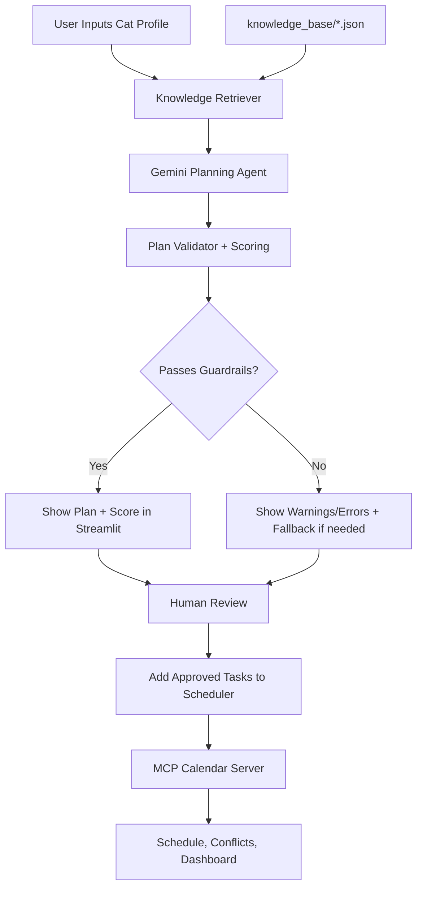

# PawPal+ AI - Cat Care Task Planning System

**Version**: 3.0  
**Date**: June 2026  
**Status**: RAG, MCP, EVAL

---

## Overview

PawPal+ AI is a cat-focused care planning app built with Streamlit and Python. It combines:

- Rule-based scheduling for day-to-day task management
- Retrieval-Augmented Generation (RAG) from a local cat-care knowledge base
- Gemini-powered AI planning
- A validator layer with scoring and logs
- a human-in-the-loop approval step before any task is scheduled.

This repository is both the product and its evaluation harness. 
Eval: a golden set, a controlled retrieval experiment, a RAGAS-style semantic metric, 
a deterministic unit suite, and an LLM-as-judge validated against human labels.


---

## Loom Demo GIF

Add your Loom-generated GIF URL below to show a quick product walkthrough directly in the README.

Loom video link: https://www.loom.com/share/88cdb91789b6442193d4a1d499d4472b

---

## What Is Implemented

### Core App Features

- Add owner and cats
- Schedule manual tasks with priority and time
- Sort tasks chronologically
- Filter by cat and status (always time-sorted)
- Detect scheduling conflicts
- Mark tasks complete and auto-create recurring tasks
- Remove tasks from schedule
- Reschedule tasks from the UI with conflict-aware time proposal

### AI Features

- **RAG retrieval** from local JSON knowledge sources:
  - breeds
  - age groups
  - health conditions
  - task templates
- **Agentic AI planning** with Gemini:
  - retrieves context
  - generates structured task plan
  - returns rationale and confidence per task
- **Reliability layer**:
  - validates output shape and field ranges
  - checks baseline care coverage (feeding/water/litter)
  - checks health-condition coverage signals
  - warns on low confidence and duplicate task-time combos
  - writes validator logs to `logs/ai_validator.log`
- **Human-in-the-loop control**:
  - user reviews plan, warnings, and score
  - user chooses exactly which suggested tasks to add (not all-or-nothing)
- **MCP server**:
  - approved tasks are scheduled to a local MCP calendar server (FastMCP); the app calls MCP tools to create calendar events

---

## Architecture

```
User input (breed dropdown, age number, free-text conditions)
        │
        ▼
KnowledgeRetriever  ──►  retrieved context (breed + age + condition guidelines)
        │                 [RAG component]
        ▼
CatTaskPlanningAgent (Gemini planner; deterministic fallback when no API key)
        │
        ▼
PlanValidator  ──►  guardrails: schema, priority/confidence ranges,
        │            baseline + health task coverage, audit logging
        │            [Security / Governance component]
        ▼
Human-in-the-loop approval  ──►  approved tasks scheduled
  [HITL / orchestration component]
        │
        ▼
MCP Calendar Server (FastMCP)  ──►  persist events to `mcp_server/calendar_store.json`
        │
        ▼
Scheduler / Dashboard (conflicts, reschedule, overview)
```

## System Diagram



---

## Project Structure

```text
applied-ai-system-project/
├── app.py
├── pawpal_system.py
├── ai_agent.py                      planner (Gemini + deterministic fallback)
├── ai_validator.py                  guardrails + audit logging
├── knowledge_retriever.py           exact-key RAG retriever (baseline)
├── embedding_retriever.py           embedding/lexical key resolution (optimized)
├── knowledge_base/                  4 knowledge sources
│   ├── breeds.json
│   ├── age_groups.json
│   ├── health_conditions.json
│   └── task_templates.json
├── mcp_server/
│   ├── calendar_client.py           MCP client your agent uses     
│   ├── calendar_server.py           FastMCP server, 3 tools
│   └── schedule_tasks.py            approved tasks → MCP calls
├── eval/
│   ├── golden.jsonl                 25-case golden set
│   ├── golden_paraphrase.jsonl      10-case free-text stress set
│   ├── run_eval.py                  coverage / grounding / forbidden scorer
│   ├── context_recall.py            RAGAS context recall
│   ├── judge.py                     LLM-as-judge (groundedness)
│   ├── sheet_from_judge.py          builds human labeling sheet from judged plans
│   ├── cohens_kappa.py              kappa from scratch
│   ├── human_labels.jsonl           human rater labels
│   ├── judge_labels_llm.jsonl       judge labels (+ saved plans)
├── tests/
│   └── test_pawpal.py           scheduler tests
│   ├── test_ai_agent.py         AI-layer tests (mocked Gemini)
│   └── task_mcp_calendar.py     MCP tests
├── requirements.txt
├── .env.example
└── README.md
```

---

## Installation and Reproducible Setup

### Prerequisites

- Python 3.8+
- pip
- Google AI API key (for live Gemini generation)

### 1. Create and activate virtual environment

```bash
python -m venv .venv
source .venv/bin/activate
```

On Windows:

```bash
.venv\Scripts\activate
```

### 2. Install dependencies

```bash
pip install -r requirements.txt
```

### 3. Configure environment variables

```bash
cp .env.example .env
```

Then edit `.env`:

```env
GOOGLE_API_KEY=your_google_generativeai_key_here
GEMINI_MODEL=gemini-2.5-flash
```

### 4. Run tests

```bash
python -m pytest tests/test_pawpal.py -v
```

### 5. Start app

```bash
streamlit run app.py
```

Optional: the MCP calendar server used by the app runs as a local FastMCP process. The app will launch the server via stdio when scheduling, but you can run it separately for debugging or inspection:

```bash
python -m mcp_server.calendar_server
# Inspect with the MCP inspector (node/npm required):
npx @modelcontextprotocol/inspector python -m mcp_server.calendar_server
```

---

## How AI Planning Works in the UI

1. Initialize owner and add at least one cat
2. Open **AI Cat Care Planner** section
3. Select a cat, optionally add health conditions and preferences
4. Click **Generate AI Plan**
5. Review:
   - model source (`gemini` or `fallback`)
   - plan summary
   - validation score/pass status
   - validation warnings/errors
   - suggested tasks table
6. Select the suggested tasks you want, then click **Add Selected AI Tasks**
7. Selected tasks are sent to the MCP calendar server and stored as scheduled events.

---

## Task Actions in the UI

In the task cards under scheduling:

- **Mark Complete**: marks task complete and creates next occurrence for recurring tasks
- **Reschedule**: pick a new time and submit; if it conflicts, system auto-shifts to the next available 15-minute slot
- **Remove Task**: deletes the task by task ID

---

## Environment Variables

- `GOOGLE_API_KEY`: Required for Gemini API calls
- `GEMINI_MODEL`: Optional model override (default: `gemini-2.5-flash`)

If `GOOGLE_API_KEY` is missing, the app uses deterministic fallback planning so the project still runs.

---

## Guardrails and Logging

### Guardrails

The validator checks:

- Required plan/task fields
- `priority` in range 1-5
- `confidence` in range 0-1
- Baseline cat-care coverage presence
- Health-condition coverage warnings
- Duplicate task/time suggestions

### Logging

- Validation logs are written to: `logs/ai_validator.log`
- Includes pass/fail, score, counts, and per-warning/per-error details

---

## Testing Notes

Current automated tests in `tests/test_pawpal.py` cover scheduler logic from the original system. AI components currently rely on runtime validation and logging; dedicated AI unit tests are a recommended next step.

---

### Eval

| Build | Output | What it does |
| --- | --- | --- |
| Golden set | `eval/golden.jsonl` (25), `eval/golden_paraphrase.jsonl` (10) | each case has input / expected task coverage / expected grounding / forbidden facts / tags |
| Deterministic unit suite | `tests/test_ai_agent.py` (10 tests) | tool/path routing, retry, error paths — Gemini mocked |
| Semantic metric | `eval/context_recall.py` | RAGAS context-recall definition, deterministic + optional LLM backend |
| LLM judge | `eval/judge.py` + `eval/cohens_kappa.py` | groundedness label per plan; Cohen's kappa vs human labels |

### 2.1 Golden set

25 canonical cases spanning all 7 breeds, 3 age groups, and all 8 health
conditions, including 2 deliberate *conflict* cases where the breed default
(e.g. high activity) is contraindicated by a health condition (e.g. arthritis,
HCM). A separate 10-case paraphrase set uses messy free-text condition strings
("kidney disease", "sugar diabetes", "overactive thyroid") to stress the
free-text input path.

Scoring (per case): task coverage ≥ 0.75, grounding ≥ 0.5, zero forbidden-fact
violations → pass.

### 2.2 Unit tests

```bash
pytest tests/test_ai_agent.py -v
```

10 tests, Gemini mocked at the single network seam (`_request_gemini`):
routing (no key → fallback; valid key → Gemini), retry on malformed JSON,
retry-exhausted → fallback, empty/ schema-invalid/ exception error paths, and
schema-bound enforcement. No API key or network required.

### 2.3 Semantic metric — context recall

RAGAS context-recall definition: fraction of a case's required grounding facts
that appear in the retrieved context. Deterministic claim-attribution backend
by default (reproducible offline); optional Gemini-judge backend.

### 2.4 LLM judge + Cohen's kappa

The judge scores one dimension — **groundedness** (are the plan's task
rationales supported by the retrieved context?) — on real Gemini plans. A human
rater independently labels the same plans (built from the judge's saved output
via `eval/sheet_from_judge.py`, so both raters score the identical artifact).
Cohen's kappa is computed from scratch in `eval/cohens_kappa.py`.

**Result: κ = 0.752 (substantial; target κ ≥ 0.60 met).**

```
items compared      : 25
observed agreement  : 0.920
expected (chance)   : 0.677
Cohen's kappa       : 0.752   (substantial)

confusion (rows = human, cols = judge):
            judge=0   judge=1
  human=0        19         0
  human=1         2         4
```

Interpretation: the judge and human agree on 23/25. The 2 disagreements are
one-directional — the human accepted as grounded what the judge flagged. The
judge is systematically *stricter* on universally-true-but-unretrieved advice
(e.g. dental care, annual vet visits the model adds but RAG did not supply).
This validates the LLM judge as a scalable proxy for human groundedness
judgment, with a known leniency offset.

---

## 3. Experiment — baseline → optimize

**Hypothesis:** exact-key retrieval silently fails on free-text health
conditions; embedding-based key resolution recovers it without regressing on
canonical input.

**Controlled change:** only the retriever differs (exact-match vs
embedding/lexical resolution). Planner, validator, scorer, and golden set are
held constant, so any metric movement is attributable to retrieval strategy.
The deterministic fallback planner is used for the controlled runs so the only
moving part is retrieval (no LLM stochasticity to confound the result).

| Round | Change | Clean set (n=25) | Paraphrase set (n=10) | Context recall (paraphrase) | Conclusion |
| --- | --- | --- | --- | --- | --- |
| 0 | Exact-key retriever (baseline) | 0.84 pass | 0.00 pass | 0.033 | brittle: free-text conditions silently drop condition-specific care |
| 1 | + embedding/lexical key resolution | 0.84 pass | 0.60 pass | 0.900 | recovers paraphrased conditions; **no regression** on canonical input |

Context recall on the paraphrase set: **0.033 → 0.900 (+0.867).**
Pass rate on the paraphrase set: **0% → 60%.**
Clean-set metrics: unchanged (embedding resolver's first step is exact-match, so
canonical input takes the identical path).

> Negative/partial result, kept deliberately: the embedding arm reaches 60%, not
> 100%. See failure analysis case (renal-failure miss) below.

Reproduce:

```bash
# clean set (regression check)
python -m eval.run_eval --retriever exact     --golden eval/golden.jsonl
python -m eval.run_eval --retriever embedding --golden eval/golden.jsonl
# paraphrase set (the experiment)
python -m eval.run_eval --retriever exact     --golden eval/golden_paraphrase.jsonl
python -m eval.run_eval --retriever embedding --golden eval/golden_paraphrase.jsonl
# context recall
python -m eval.context_recall --golden eval/golden_paraphrase.jsonl
```

---

## 4. Analysis

### 4.1 Failure analysis

**Failure 1 — "renal failure" not resolved (paraphrase set, case `para_09`).**
The lexical resolver maps "kidney disease" → `chronic_kidney_disease` via the
alias table, but "renal failure" shares no surface tokens with the canonical
key and falls below the similarity threshold, so it resolves to `None` and the
condition-specific care is dropped. This is why the embedding arm is 60%, not
100%. *Fix options & trade-off:* add a medical-synonym alias (cheap, but
unscalable), lower the similarity threshold (risks false matches), or swap the
lexical backend for real sentence-transformer embeddings (best recall, adds a
dependency and ~latency). Left unfixed and documented as an honest ceiling.

**Failure 2 — monitoring-variant normalization gap (clean set).**
Four clean-set health cases fail coverage because the knowledge base uses
specific task strings (`monitoring_breathing`, `rest_monitoring`,
`monitoring_mobility`) that the validator's alias map does not normalize to
`monitoring`. The plan *does* include monitoring, under a more specific label;
the eval's coverage check does not credit it. *Judgment call:* mapping the
variants → `monitoring` would lift clean-set pass to ~100%, but arguably games
the metric. Documented rather than silently patched.

**Failure 3 — LLM-judge vs human disagreements (cases: `case_05` and `case_13`).**
The 2 kappa disagreements are plans where Gemini added generally-valid care
(dental / vet) absent from the retrieved context. The human labeled these
grounded (reasonable baseline advice); the judge labeled them not grounded
(strict faithfulness). Neither is wrong — it is a definitional boundary on what
"grounded" means, and it quantifies the judge's strictness offset.

**Failure 4 — forbidden-fact false positive (negation blindness).**
Two HCM cases were flagged for the forbidden phrase "intense exercise." Investigation showed the plans correctly advised limited intense exercise (from the HCM care requirement "Limited intense exercise"); the naive substring check ignored the negating qualifier. Fixed by making the forbidden-fact check negation-aware (scanning the preceding window for limiters like "limited"/"avoid"/"restrict"), verified to still flag genuine contraindications. Lesson: keyword-based safety checks need negation handling — the same failure mode that affects production content filters.

### 4.2 Trade-off (one line)

Embedding key-resolution traded a small latency/dependency cost for a large
groundedness/recall gain on free-text input (context recall +0.867), with zero
regression on canonical input.

---

## 5. Running everything

```bash
# tests
pytest

# experiment + metrics (no API key needed)
python -m eval.run_eval --retriever exact     --golden eval/golden_paraphrase.jsonl
python -m eval.run_eval --retriever embedding --golden eval/golden_paraphrase.jsonl
python -m eval.context_recall --golden eval/golden_paraphrase.jsonl

# LLM judge + kappa (needs GOOGLE_API_KEY)
export GOOGLE_API_KEY="..."
python -m eval.judge --golden eval/golden.jsonl --backend llm --out eval/judge_labels_llm.jsonl
python -m eval.sheet_from_judge --judge eval/judge_labels_llm.jsonl   # then hand-label human_labels.jsonl
python -m eval.cohens_kappa --human eval/human_labels.jsonl --judge eval/judge_labels_llm.jsonl
```

---

## Known Limitations

- AI task-to-enum mapping is heuristic (not ontology-based)
- Knowledge base is local JSON (no vector DB yet)
- State is in-memory during runtime (no persistent database storage)

---

## Next Improvements

- Add stricter validator enforcement mode (block on failed validation)
- Add optional vector search for semantic retrieval
- Add persistent storage for plans and validation reports