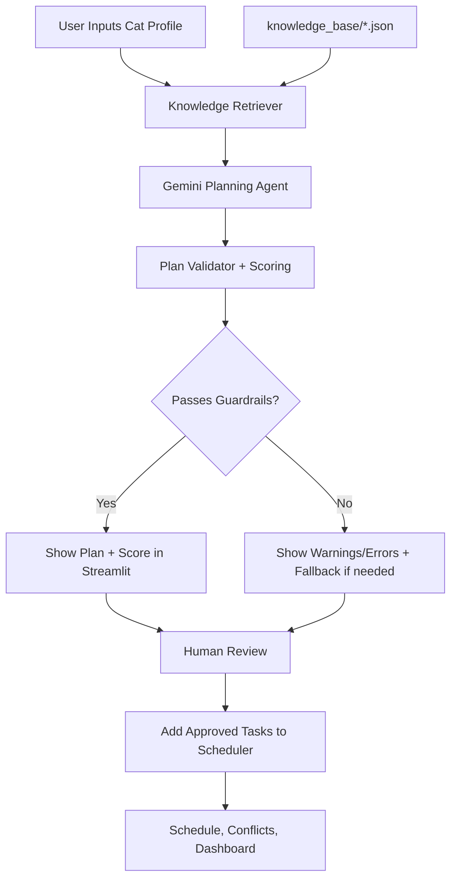

# PawPal+ AI - Cat Care Task Planning System

**Version**: 3.0  
**Date**: June 2026  
**Status**: AI features integrated

---

## Overview

PawPal+ AI is a cat-focused care planning app built with Streamlit and Python. It combines:

- Rule-based scheduling for day-to-day task management
- Retrieval-Augmented Generation (RAG) from a local cat-care knowledge base
- Gemma-powered AI planning
- A validator layer with scoring and logs

The result is a practical workflow where AI suggestions are checked before being added to your schedule.


---

## Loom Demo GIF

Add your Loom-generated GIF URL below to show a quick product walkthrough directly in the README.

Loom video link: https://www.loom.com/share/88cdb91789b6442193d4a1d499d4472b

---

## What Is Implemented

### Core App Features

- Add owner and cats
- Schedule manual tasks with priority and time
- Sort tasks chronologically
- Filter by cat and status (always time-sorted)
- Detect scheduling conflicts
- Mark tasks complete and auto-create recurring tasks
- Remove tasks from schedule
- Reschedule tasks from the UI with conflict-aware time proposal

### AI Features

- **RAG retrieval** from local JSON knowledge sources:
  - breeds
  - age groups
  - health conditions
  - task templates
- **Agentic AI planning** with Gemini:
  - retrieves context
  - generates structured task plan
  - returns rationale and confidence per task
- **Reliability layer**:
  - validates output shape and field ranges
  - checks baseline care coverage (feeding/water/litter)
  - checks health-condition coverage signals
  - warns on low confidence and duplicate task-time combos
  - writes validator logs to `logs/ai_validator.log`
- **Human-in-the-loop control**:
  - user reviews plan, warnings, and score
  - user chooses exactly which suggested tasks to add (not all-or-nothing)

---

## System Diagram



---

## Project Structure

```text
applied-ai-system-project/
├── app.py
├── pawpal_system.py
├── ai_agent.py
├── ai_validator.py
├── knowledge_retriever.py
├── knowledge_base/
│   ├── breeds.json
│   ├── age_groups.json
│   ├── health_conditions.json
│   └── task_templates.json
├── tests/
│   └── test_pawpal.py
├── requirements.txt
├── .env.example
└── README.md
```

---

## Installation and Reproducible Setup

### Prerequisites

- Python 3.8+
- pip
- Google AI API key (for live Gemini generation)

### 1. Create and activate virtual environment

```bash
python -m venv .venv
source .venv/bin/activate
```

On Windows:

```bash
.venv\Scripts\activate
```

### 2. Install dependencies

```bash
pip install -r requirements.txt
```

### 3. Configure environment variables

```bash
cp .env.example .env
```

Then edit `.env`:

```env
GOOGLE_API_KEY=your_google_generativeai_key_here
GEMINI_MODEL=gemini-2.5-flash
```

### 4. Run tests

```bash
python -m pytest tests/test_pawpal.py -v
```

### 5. Start app

```bash
streamlit run app.py
```

---

## How AI Planning Works in the UI

1. Initialize owner and add at least one cat
2. Open **AI Cat Care Planner** section
3. Select a cat, optionally add health conditions and preferences
4. Click **Generate AI Plan**
5. Review:
   - model source (`gemini` or `fallback`)
   - plan summary
   - validation score/pass status
   - validation warnings/errors
   - suggested tasks table
6. Select the suggested tasks you want, then click **Add Selected AI Tasks**

---

## Task Actions in the UI

In the task cards under scheduling:

- **Mark Complete**: marks task complete and creates next occurrence for recurring tasks
- **Reschedule**: pick a new time and submit; if it conflicts, system auto-shifts to the next available 15-minute slot
- **Remove Task**: deletes the task by task ID

---

## Environment Variables

- `GOOGLE_API_KEY`: Required for Gemini API calls
- `GEMINI_MODEL`: Optional model override (default: `gemini-2.5-flash`)

If `GOOGLE_API_KEY` is missing, the app uses deterministic fallback planning so the project still runs.

---

## Guardrails and Logging

### Guardrails

The validator checks:

- Required plan/task fields
- `priority` in range 1-5
- `confidence` in range 0-1
- Baseline cat-care coverage presence
- Health-condition coverage warnings
- Duplicate task/time suggestions

### Logging

- Validation logs are written to: `logs/ai_validator.log`
- Includes pass/fail, score, counts, and per-warning/per-error details

---

## Testing Notes

Current automated tests in `tests/test_pawpal.py` cover scheduler logic from the original system. AI components currently rely on runtime validation and logging; dedicated AI unit tests are a recommended next step.

---

## Known Limitations

- AI task-to-enum mapping is heuristic (not ontology-based)
- Suggested times are parsed with best-effort rules
- Validation warnings do not hard-block adding tasks
- Knowledge base is local JSON (no vector DB yet)
- State is in-memory during runtime (no persistent database storage)

---

## Next Improvements

- Add unit tests for `knowledge_retriever.py`, `ai_agent.py`, and `ai_validator.py`
- Add stricter validator enforcement mode (block on failed validation)
- Add optional vector search for semantic retrieval
- Add persistent storage for plans and validation reports
